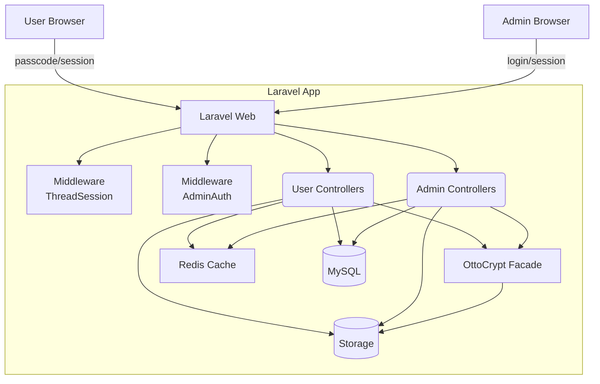

# CipherRelay

**Encrypted, passcode‑based message dropbox built with Laravel 12, MySQL, and Redis.**

CipherRelay lets end‑users submit an initial message + file, receive a 4‑word passcode, and later return with that passcode to continue the conversation. Admins can see all threads, reply, change status, add internal notes, and download encrypted attachments. All texts and files are encrypted at rest using the [ivansostarko/otto-crypt-php] package.

> **Why?** A simple, auditable, end‑to‑end–style workflow for sensitive submissions without creating user accounts.

---

## Table of Contents
- [Features](#features)
- [Screens & Flow](#screens--flow)
- [Security Model](#security-model)
- [Tech Stack](#tech-stack)
- [Architecture](#architecture)
- [Requirements](#requirements)
- [Installation](#installation)
- [Configuration](#configuration)
- [Database & Migrations](#database--migrations)
- [Run & Usage](#run--usage)
- [Caching Strategy](#caching-strategy)
- [Search & Privacy](#search--privacy)
- [Production Hardening](#production-hardening)
- [Roadmap](#roadmap)
- [Contributing](#contributing)
- [License](#license)
- [FAQ](#faq)
- [Acknowledgements](#acknowledgements)

---

## Features
- 🔐 **At-rest encryption for text & files** using OttoCrypt (cipher + header for strings; streaming for files)
- 🧩 **Passcode access** (4 human-readable words like `word-word-word-word`)
- 👥 **Two roles:** anonymous **User** (passcode session) and **Admin** (login session)
- 📨 **Threaded messaging** with attachments
- 🗒️ **Admin-only notes** per thread
- 📊 **Admin inbox**: paginated, filterable by status, subject-search (see notes on encrypted search)
- 🎚️ **Statuses:** `new_from_user`, `add_more`, `closed`
- 🌓 **Dark/Light theme** (Tailwind; localStorage toggle)
- 🚀 **Redis** for cache + sessions

---

## Screens & Flow

### User
1. **Landing** → Buttons: *First time submitting* / *I have submitted already*
2. **First time** → Submit **Subject**, **Message**, **File (optional)**. A new thread is created.
3. **Passcode screen** → Shows the generated **4‑word passcode** (copy it; shown once).
4. **Returning** → Enter passcode to authenticate.
5. **Thread** → View messages, add a message (+ file), delete own messages, download attachments.

### Admin
1. **Login** → Email/password (seeded `admin@example.com` / `password`)
2. **Inbox** → Table of threads (Subject, Created, Status) with pagination & filters
3. **Thread detail** → Conversation, reply form, status dropdown, **notes** panel, file download


---

## Security Model

**Encryption primitives are provided by OttoCrypt; CipherRelay integrates them as follows:**

- **Per‑thread key:** Derived deterministically from the user passcode via `SHA‑256(passcode)` (32 raw bytes).
- **Text encryption:** `Otto::encryptString($plaintext, options: ['raw_key' => $threadKey])` returns `(cipher, header)`, both stored (base64) in DB.
- **File encryption:** Streaming `encryptFile` writes an `.otto` blob to storage; download decrypts on the fly.
- **Admin access to threads:** The per‑thread key is also encrypted with a **master password** `OTTO_MASTER_PASSWORD` and stored as `(key_cipher, key_header)`, so admins can decrypt without knowing the user passcode.
- **Passcode storage:** Only a **bcrypt hash** of the passcode is stored for verification.
- **Sessions:** User thread access uses a short-lived session holding `thread_id` + base64 encoded `thread_key` (not the passcode). Admin auth is session-based.
- **No plaintext at rest:** Subjects, bodies, and files are only readable after decryption.

> **Note:** If you prefer a random per-thread key (not derived from passcode), the current design already supports it—generate a random 32‑byte key and store it encrypted with the master password (instead of deriving).

---

## Tech Stack
- **Framework:** Laravel 12 (PHP 8.2+)
- **Database:** MySQL (or MariaDB)
- **Cache & Sessions:** Redis
- **Encryption:** `ivansostarko/otto-crypt-php`
- **Frontend:** Blade + TailwindCSS (CDN), dark/light theme toggle

---

## Architecture



**Key paths**
- `app/Http/Controllers/User/*` — landing, submission, thread, file download
- `app/Http/Controllers/Admin/*` — auth, inbox, thread management
- `app/Http/Middleware/*` — `ThreadSession`, `AdminAuth`
- `app/Models/*` — `Admin`, `Thread`, `Message`, `MessageNote`
- `routes/web.php` — user routes
- `routes/admin.php` — admin routes
- `resources/views/*` — Blade views (Tailwind)

---

## Requirements
- PHP **8.2+**
- Composer
- MySQL 8+ (or MariaDB 10.6+)
- Redis 6+
- Node (optional if you later compile Tailwind locally; current setup uses CDN)

---

## Installation

1) **Create a fresh project & install deps**
```bash
composer create-project laravel/laravel cipherrelay "^12.0"
cd cipherrelay
composer require predis/predis
composer require ivansostarko/otto-crypt-php
php artisan vendor:publish --provider="IvanSostarko\OttoCrypt\OttoCryptServiceProvider"
```

2) **Copy the app code** from this repo (`app/`, `routes/`, `database/`, `resources/`, `config/pass_words.php`) into your project.

3) **.env configuration** (see [Configuration](#configuration)).

4) **Register middleware aliases & admin routes** in `bootstrap/app.php` (Laravel 12 style):
```php
use Illuminate\Foundation\Application;
use Illuminate\Foundation\Configuration\Middleware;
use Illuminate\Support\Facades\Route;

return Application::configure(basePath: dirname(__DIR__))
    ->withMiddleware(function (Middleware $middleware) {
        $middleware->alias([
            'admin.auth'     => \App\Http\Middleware\AdminAuth::class,
            'thread.session' => \App\Http\Middleware\ThreadSession::class,
        ]);
    })
    ->withRouting(
        web: __DIR__.'/../routes/web.php',
        commands: __DIR__.'/../routes/console.php',
        health: '/up',
        then: function () {
            Route::prefix('admin')->middleware('web')->group(base_path('routes/admin.php'));
        },
    )->create();
```

5) **Migrate & seed**
```bash
php artisan migrate
php artisan db:seed --class=AdminSeeder
# optional sample thread:
php artisan db:seed --class=DemoDataSeeder
```

6) **Storage & directories**
```bash
php artisan storage:link
mkdir -p storage/app/private/messages storage/app/private/tmp
```

7) **Run**
```bash
php artisan serve
```
Open `http://127.0.0.1:8000` (user) and `http://127.0.0.1:8000/admin/login` (admin).

---

## Configuration

Set in `.env` (required unless noted):

| Key | Description |
| --- | --- |
| `DB_*` | Standard Laravel DB settings (MySQL). |
| `CACHE_DRIVER=redis` | Required for caching. |
| `SESSION_DRIVER=redis` | Store sessions in Redis. |
| `OTTO_MASTER_PASSWORD` | **Strong** master password used to encrypt per-thread keys so Admin can decrypt without user passcode. |
| `QUEUE_CONNECTION=sync` | Default ok; consider `redis` for background jobs in production. |

Additional knobs (edit in controllers as needed):
- Max file upload size: validation rule `file|max:51200` (≈50MB) in controllers.
- Passcode word list: `config/pass_words.php` (use `WordSeeder` to overwrite if you prefer a different list).

---

## Database & Migrations
- `admins` — Admin accounts (seeded `admin@example.com` / `password`)
- `threads` — One per conversation; stores `passcode_hash` (bcrypt), `status`, and encrypted per-thread key `(key_cipher, key_header)`
- `messages` — Each message stores `(subject_cipher, subject_header)` and `(body_cipher, body_header)` plus optional `file_*`
- `message_notes` — Admin-only notes per thread

---

## Run & Usage

### User Routes
| Method | Path | Description |
| --- | --- | --- |
| GET | `/` | Landing (choose first time / already submitted) |
| GET | `/first` | First submission form |
| POST | `/first` | Create thread, upload file, show passcode |
| GET | `/passcode` | Enter passcode (returning users) |
| POST | `/passcode` | Authenticate passcode and store thread session |
| GET | `/thread` | View messages (requires `thread.session`) |
| POST | `/thread/message` | Add message + optional file |
| DELETE | `/thread/message/{message}` | Delete **own** message |
| GET | `/file/{message}/download` | Download attachment (decrypted on fly) |

### Admin Routes (prefixed with `/admin`)
| Method | Path | Description |
| --- | --- | --- |
| GET | `/login` | Login page |
| POST | `/login` | Start admin session |
| POST | `/logout` | Logout |
| GET | `/` | Inbox: paginated threads, search, filter by status |
| GET | `/threads/{thread}` | Thread detail (decrypts via master password) |
| POST | `/threads/{thread}/message` | Reply + optional file |
| POST | `/threads/{thread}/status` | Change status |
| POST | `/threads/{thread}/note` | Add admin-only note |
| GET | `/file/{thread}/{message}/download` | Download attachment (admin) |

> **Default admin:** `admin@example.com` / `password` (seeded by `AdminSeeder`). Change immediately.

---

## Caching Strategy
- **Per-thread messages:** `thread:{id}:messages` → list of messages (60s TTL by default). Invalidated on message create/delete.
- **Admin inbox pages:** `admin:threads:index:q={q}:status={status}:page={n}` (30s). Invalidated when a message or status changes.
- **Sessions:** Redis-backed for both User (thread session) and Admin.

> Tune TTLs or switch to cache tags if you plan to scale significantly.

---

## Search & Privacy
- Subjects/bodies are **encrypted** at rest, so the DB can’t index them.
- The admin inbox decrypts the **first message subject** in memory for display/search. This is acceptable for small/medium volume; for large scale, consider:
  - A separate **plaintext or hashed index** column updated at write time (trade-off!), or
  - Client-side search on already-decrypted data.

---

## Production Hardening
- **Rotate** `OTTO_MASTER_PASSWORD` using a re-wrap procedure (decrypt per-thread keys with old, re-encrypt with new).
- **HTTPS only**; set secure cookies and `SESSION_SECURE_COOKIE=true`.
- **Rate limit** passcode attempts (`/passcode`). Consider throttling middleware.
- **Queue** heavy file crypto and virus-scan uploads (ClamAV or a SaaS).
- **Backups** for DB and encrypted storage; keep master password safe.
- **Secrets** in a proper KMS or secrets manager.
- **Policies** (e.g., deny admin file download if not permitted) and audit logs.

---

## Roadmap
- Diceware 7k+ word list & i18n passcodes
- Optional random-per-thread keys (vs derived)
- Email/SMS notifications to admins
- Multi-admin roles & permissions; audit trail
- API endpoints (for headless frontends)
- Full-text search on encrypted data via searchable metadata/indexes
- Tests (Pest) and CI (GitHub Actions)

---

## Contributing
1. Fork & create a feature branch
2. Follow Laravel conventions; run `php artisan pint` for style
3. Use clear commit messages (Conventional Commits preferred)
4. Open a PR with a concise description and screenshots if UI changes

---

## License
**MIT** — see `LICENSE`.

---

## FAQ
**Q: Can admins read data without the user passcode?**  
A: Yes. Each thread’s raw key is encrypted with a master password and stored. With `OTTO_MASTER_PASSWORD`, admins decrypt thread content.

**Q: What happens if the passcode is lost?**  
A: Users can’t authenticate to the thread. Admin still has access via the encrypted key mechanism.

**Q: Can I change the passcode format?**  
A: Yes. Update the generator to use a different dictionary or count; swap to Diceware for larger entropy.

**Q: Why not store plaintext subjects for easier search?**  
A: That’s a privacy trade-off you can enable if required. This repo chooses encryption-first.

**Q: How big can files be?**  
A: Default is ~50MB (`max:51200`). Raise as needed and ensure server limits (`post_max_size`, `upload_max_filesize`).

---

## Acknowledgements
- **Encryption:** [ivansostarko/otto-crypt-php]
- **Framework:** Laravel
- Community contributions welcome!
